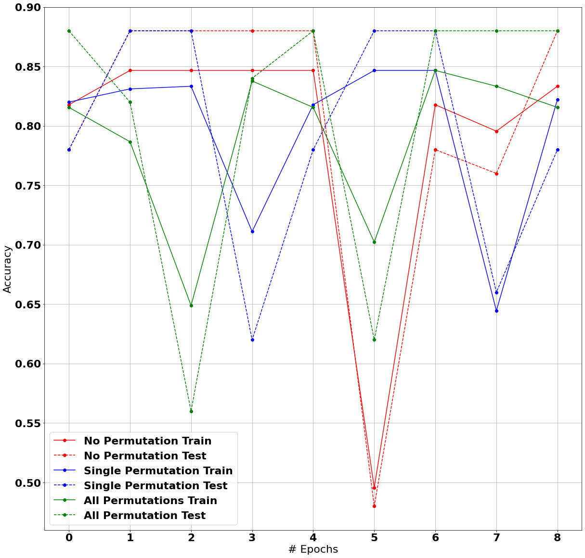

# Perceptron Practical
### Task 1
Implementing my own Scalar and Vector classes

A few things about this implementation:
- I like python functional api, so i use ``map(..)`` to apply same operation to all values in the sequence
    - for scalar x vector multiplication, i multiply every entry in vector by the value of scalar
    - for vector-by-scalar division, i divide every item in vector by scalar value
- For vector-by-vector multiplication i multiply corresponding items in each vector, then apply ``sum(..)`` reduction


```python
from typing import Union, List, Tuple
from math import sqrt
class Scalar:
    pass
class Vector:
    pass

class Scalar:
    def __init__(self: Scalar, val: float):
        self.val = float(val)
        
    def __mul__(self: Scalar, other: Union[Scalar, Vector]) -> Union[Scalar, Vector]:
        # hint: use isinstance to decide what `other` is
        # raise an error if `other` isn't Scalar or Vector!
        if isinstance(other, Scalar):
            return Scalar(self.val * other.val)
        elif isinstance(other, Vector):
            return Vector(
                *map(
                    lambda entry: entry*self.val,
                    other.entries
                )
            )
        else:
            raise ValueError("other must be a Scalar or Vector")
    
    def __add__(self: Scalar, other: Scalar) -> Scalar:
        return Scalar(self.val + other.val)
    
    def __sub__(self: Scalar, other: Scalar) -> Scalar:
        return Scalar(self.val - other.val)
    
    def __truediv__(self: Scalar, other: Scalar) -> Scalar:
        return Scalar(self.val / other.val) # implement division of scalars
    
    def __rtruediv__(self: Scalar, other: Vector) -> Vector:
        return Vector(
            *map(
                lambda entry: entry/self.val,
                other.entries
            )
        ) # implement division of vector by scalar
    
    def __repr__(self: Scalar) -> str:
        return "Scalar(%r)" % self.val
    
    def sign(self: Scalar) -> int:
        if self.val > 0:
            return 1
        elif self.val == 0:
            return 0
        else:
            return -1
        # returns -1, 0, or 1
    
    def __float__(self: Scalar) -> float:
        return self.val

class Vector:
    def __init__(self: Vector, *entries: List[float]):
        self.entries = entries
        
    @staticmethod
    def zero(size: int) -> Vector:
        return Vector(*[0 for i in range(size)])
    
    def __add__(self: Vector, other: Vector) -> Vector:
        assert len(self) == len(other), "vector lengths must match"
        new_entries = [x1 + x2 for x1, x2 in zip(self.entries, other.entries)]
        return Vector(*new_entries)
    
    def __sub__(self: Vector, other: Vector) -> Vector:
        return self + Scalar(-1)*other
    
    def __mul__(self: Vector, other: Vector) -> Scalar:
        assert len(self) == len(other), "vector lengths must match"
        value = sum(x1*x2 for x1, x2 in zip(self.entries, other.entries))
        return Scalar(value)
    
    def magnitude(self: Vector) -> Scalar:
        value = sqrt(sum(x_i**2 for x_i in self.entries))
        return Scalar(value)
    
    def unit(self: Vector) -> Vector:
        return self / self.magnitude()
    
    def __len__(self: Vector) -> int:
        return len(self.entries)
    
    def __repr__(self: Vector) -> str:
        return "Vector %s" % repr(self.entries)
    
    def __iter__(self: Vector):
        return iter(self.entries)
```

### Task 2
Implementing PerceptronTrain and PerceptronTest

Details:
- General equation for perceptron is: $$ \hat{y} = sign(w \times x + b) $$
- For my case D will be an iterable(list) of two-item tuples, where first item is feature vector `x` and second item is target scalar value `y`
- I've added additional parameter dim, which corresponds to feature vector dimension. This is to simplify initializing weights
- `do_permutation` is a helper param for task 5


```python
from random import choices
def perceptron_train(D: List[Tuple[Vector, Scalar]], max_iter: int, dim: int, do_permutation: bool = False):
    # Initialization
    w = Vector.zero(dim) # weights
    b = Scalar(0) # bias
    
    # Training
    for i in range(max_iter):
        if do_permutation:
            D_i = choices(D, k=len(D))
        else:
            D_i = D
        for x, y in D_i:
            a = w * x + b
            if (y*a).sign() <= 0: # training happens
                w += y * x
                b += y
                
    return w, b

def perceptron_test(w: Vector, b: Scalar, x_hat: Vector):
    a = w*x_hat + b
    return a.sign()
```

### Task 3:
90-10 split and first evaluation

- There was absolutely zero information about how we should measure the performance of the model, which is really important. I assume, because we are using signs in perceptron_test, that it is a classification task, so accuracy score must be suitable for that
- For some reason performance bounces up and down, depending on the seed, and sometimes it isn't very good, as assumed in the task definition
- For reproduceability, i fix random seed


```python
def compute_accuracy(w, b, test_dataset):
    y_pred = list(map(
        lambda point: perceptron_test(w, b, point),
        test_dataset[0]
    ))

    accuracy = sum(y.sign() == y_hat for y, y_hat in zip(test_dataset[1], y_pred)) / len(y_pred)
    return accuracy

import random
random.seed(1984) # some seeds are more equal than others

from random import randint
v = Vector(randint(-100, 100), randint(-100, 100))
xs = [Vector(randint(-100, 100), randint(-100, 100)) for i in range(500)]
ys = [v * x * Scalar(randint(-1, 9)) for x in xs]

divpoint = round(len(xs) * 0.9)
train_dataset = zip(xs[:divpoint], ys[:divpoint])
test_dataset = xs[divpoint:], ys[divpoint:]

w, b = perceptron_train(train_dataset, 1000, 2)

accuracy = compute_accuracy(w, b, test_dataset)

print(f"Accuracy score on test set is: {accuracy}")
```

    Accuracy score on test set is: 0.7


### Task 4:
make 90-10 split and test on xor dataset

- There was an error in data generation: `-1` in ys was not wrapped into `Scalar`


```python
random.seed(1984)
from random import randint
xs = [Vector(randint(-100, 100), randint(-100, 100)) for i in range(500)]
ys = [Scalar(1) if x.entries[0]*x.entries[1] < 0 else Scalar(-1) for x in xs]

divpoint = round(len(xs) * 0.9)
train_dataset = zip(xs[:divpoint], ys[:divpoint])
test_dataset = xs[divpoint:], ys[divpoint:]

w, b = perceptron_train(train_dataset, 1000, 2)

accuracy = compute_accuracy(w, b, test_dataset)

print(f"Accuracy score on test set is: {accuracy}")
```

    Accuracy score on test set is: 0.42


### Task 5:
Sorting data and plotting performance


```python
import matplotlib.pylab as plt
import matplotlib
%matplotlib inline

# re-generating the data
import random
random.seed(1984) # some seeds are more equal than others

from random import randint
v = Vector(randint(-100, 100), randint(-100, 100))
xs = [Vector(randint(-100, 100), randint(-100, 100)) for i in range(500)]
ys = [v * x * Scalar(randint(-1, 9)) for x in xs]

divpoint = round(len(xs) * 0.9)
train_x, train_y = xs[:divpoint], ys[:divpoint]
test_x, test_y = xs[divpoint:], ys[divpoint:]

# sorting train data
indexs = list(range(len(train_x)))
indexs = sorted(indexs, key=lambda i: train_y[i].val)

no_permutation = [(train_x[i], train_y[i]) for i in indexs]
single_permutation = choices(no_permutation, k=len(no_permutation))
train_for_testing = list(zip(*no_permutation))

from tqdm.auto import tqdm
no_permutation_train, no_permutation_test = [], []
single_permutation_train, single_permutation_test = [], []
all_permutation_train, all_permutation_test = [], []

for i in tqdm(range(1, 10)): # from 1 to 250 epochs
    random.seed(1984)
    w, b = perceptron_train(no_permutation, max_iter=i, dim=2)
    no_permutation_train.append(compute_accuracy(w, b, train_for_testing))
    no_permutation_test.append(compute_accuracy(w, b, [test_x, test_y]))
    
    w, b = perceptron_train(single_permutation, max_iter=i, dim=2)
    single_permutation_train.append(compute_accuracy(w, b, train_for_testing))
    single_permutation_test.append(compute_accuracy(w, b, [test_x, test_y]))
    
    w, b = perceptron_train(no_permutation, max_iter=i, dim=2, do_permutation=True)
    all_permutation_train.append(compute_accuracy(w, b, train_for_testing))
    all_permutation_test.append(compute_accuracy(w, b, [test_x, test_y]))

font = {
    'family' : 'DejaVu Sans',
    'weight' : 'bold',
    'size'   : 22
}

matplotlib.rc('font', **font)

_ = plt.figure(figsize=(20.0, 20.0))
plt.grid(True)
plt.plot(no_permutation_train, 'ro-')
plt.plot(no_permutation_test, 'ro--')

plt.plot(single_permutation_train, 'bo-')
plt.plot(single_permutation_test, 'bo--')

plt.plot(all_permutation_train, 'go-')
plt.plot(all_permutation_test, 'go--')

plt.legend([
    'No Permutation Train', 'No Permutation Test',
    'Single Permutation Train', 'Single Permutation Test',
    'All Permutations Train', 'All Permutation Test'
])

plt.ylabel("Accuracy")
plt.xlabel("# Epochs")

plt.savefig("./Performance_evaluation.png")
```


    HBox(children=(FloatProgress(value=0.0, max=9.0), HTML(value='')))


    


    

    


### Task 6:
Implement AvaragedPerceptronTrain and compare it's performance

Note: 
- Averaged Perceptron significantly outperforms regular perceptron by accuracy (delta ~= 0.18)


```python
def averaged_perceptron_train(D: List[Tuple[Vector, Scalar]], max_iter: int, dim: int):
    # Initialization
    w = Vector.zero(dim) # weights
    b = Scalar(0) # bias
    u = Vector.zero(dim) # c_weight
    beta = Scalar(0) # beta
    c = Scalar(1) # counter
    
    one = Scalar(1) # constant
    
    # Training
    for i in range(max_iter):
        for x, y in D:
            a = w * x + b
            if (y*a).sign() <= 0: # training happens
                w += y * x
                b += y
                u += y*c*x
                beta += y*c
            c = c + one
    return w - ((one/c) * u), b - ((one/c)*beta)

# re-generating the data
import random
random.seed(1984) # some seeds are more equal than others

from random import randint
v = Vector(randint(-100, 100), randint(-100, 100))
xs = [Vector(randint(-100, 100), randint(-100, 100)) for i in range(500)]
ys = [v * x * Scalar(randint(-1, 9)) for x in xs]

divpoint = round(len(xs) * 0.9)
train_x, train_y = xs[:divpoint], ys[:divpoint]
test_x, test_y = xs[divpoint:], ys[divpoint:]

aw, ab = averaged_perceptron_train(list(zip(train_x, train_y)), max_iter=100, dim=2)
w, b = perceptron_train(list(zip(train_x, train_y)), max_iter=100, dim=2, do_permutation=True)

a_accuracy = compute_accuracy(aw, ab, [test_x, test_y])
accuracy = compute_accuracy(w, b, [test_x, test_y])

print(f"Avg. perceptron accuracy: {a_accuracy}")
print(f"Regular perceptron accuracy: {accuracy}")
```

    Avg. perceptron accuracy: 0.88
    Regular perceptron accuracy: 0.7

