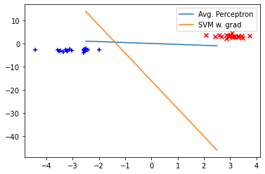

# SVM Practical

-----
## Task 1:
Read the documentation for scipy.optimize.minimize, paying special attention to the Jacobian argument jac.
### 1.1:
Who computes the gradient, the minimize function itself, or the developer using it?
 - There are multiple options:
     - Developer could compute the gradient value and return it in target function call
     - Developer could supply gradient function and minimize will use it to compute gradient value

### 1.2:
Run the following two examples; which performs better?


```python
import scipy.optimize, numpy.random
def f(x):
    return x**2

def df(x):
    return 2*x

print(scipy.optimize.minimize(f, numpy.random.randint(-1000, 1000), jac=df))
```

          fun: 1.2924697071141057e-26
     hess_inv: array([[0.5]])
          jac: array([-2.27373675e-13])
      message: 'Optimization terminated successfully.'
         nfev: 7
          nit: 2
         njev: 7
       status: 0
      success: True
            x: array([-1.13686838e-13])


```python
import scipy.optimize, numpy.random
def f(x):
    return x**2

print(scipy.optimize.minimize(f, numpy.random.randint(-1000, 1000), jac=False))
```

          fun: 5.560448944600495e-17
     hess_inv: array([[0.49999992]])
          jac: array([-1.25223814e-11])
      message: 'Optimization terminated successfully.'
         nfev: 21
          nit: 4
         njev: 7
       status: 0
      success: True
            x: array([-7.45684179e-09])


So, technically first function performs better, because it returns minimal value that is closer to zero(which is actual minimal value)

----

## Task 2
Write in python the loss function for support vector machines from equation (7.48) of Daumé. You can use the following hinge loss surrogate:
- I'll assume that D is actually a set of points of the following format {(x_1, x_2), y}


```python
import numpy as np

def hinge_loss_surrogate(y_gold, y_pred):
    return numpy.maximum(0, 1 - y_gold * y_pred) # fix, max of two values is actually np.maximum

def svm_loss(w, b, C, D):
    w = w.squeeze()
    accum = 0
    for x, y in D:
        dp = np.dot(w, x)
        y_hat = (dp + b)
        surrogate_value = hinge_loss_surrogate(y, y_hat)
        accum += surrogate_value
        
    slack = C * accum
    l2 = (1/2) * np.sqrt(np.sum(np.square(w)))
    loss_value = l2 + slack
    return loss_value
```

----
## Task 3
Use scipy.optimize.minimize with jac=False to implement support vector machines.


```python
from functools import partial
import sys

def svm(D):
    def objective(params):
        w1, w2, b = params
        w = np.array([w1, w2])
        return svm_loss(w, b, 1.0, D)
    
    initial_guess = [np.random.uniform(size=1), np.random.uniform(size=1), 0]
    result = scipy.optimize.minimize(objective, initial_guess, jac=False)
    if result.success:
        w1, w2, b = result.x
        return np.array([w1, w2]), b
    else:
        print(f"Minimization unseccessful: {result.message}", file=sys.stderr)
        w1, w2, b = result.x
        return np.array([w1, w2]), b
```

---
## Task 4
Implement the gradient of svm_loss, and add an optional flag to svm to use it:


```python
def gradient_hinge_loss_surrogate(y_gold, y_pred):
    if hinge_loss_surrogate(y_gold, y_pred) == 0:
        return [0, 0]
    else:
        return [-y_pred, -y_gold]

def gradient_svm_loss(w, b, C, D):
    w1, w2, b = 0, 0, 0
    w = w.squeeze()
    for x, y in D:
        dp = np.dot(w, x)
        y_hat = (dp + b)
        hinge_grad = gradient_hinge_loss_surrogate(y, y_hat)
        grad_b = hinge_grad[1]
        grad_w1 = hinge_grad[1] * x[0]
        grad_w2 = hinge_grad[1] * x[1]
        w1 += grad_w1
        w2 += grad_w2
        b += grad_b
        
    w1 = C*w1 - w[0]/2
    w2 = C*w2 - w[1]/2
    b = C*b
    return np.array([w1, w2, b])

def svm(D, use_gradient=False):
    def objective(params):
        w1, w2, b = params
        w = np.array([w1, w2])
        return svm_loss(w, b, 1.0, D)
    
    def jac(params):
        w1, w2, b = params
        w = np.array([w1, w2])
        return gradient_svm_loss(w, b, 1.0, D)
    
    initial_guess = np.random.uniform(size=3)
    if use_gradient:
        result = scipy.optimize.minimize(objective, initial_guess, method='BFGS', jac=jac)
    else:
        result = scipy.optimize.minimize(objective, initial_guess, method='BFGS', jac=False)
    if result.success:
        w1, w2, b = result.x
        return np.array([w1, w2]), b
    else:
        print(f"Minimization unseccessful: {result.message}", file=sys.stderr)
        w1, w2, b = result.x
        return np.array([w1, w2]), b
```

---
## Task 5
Use numpy.random.normal to generate two isolated clusters of points in 2 dimensions, one x_plus and one x_minus, and graph the three hyperplanes found by training:

- an averaged perceptron
- support vector machine without gradient
- support vector machine with gradient.

How do they compare?


```python
## Generating data

x_1 = np.random.normal(loc=[-3.0, -3.0], scale=0.5, size=(20, 2))
x_2 = np.random.normal(loc=[3.0, 3.0], scale=0.5, size=(20, 2))
x = np.concatenate([x_1, x_2])
y = ([0]*100) + ([1]*100)
data = list(zip(x, y))
```


```python
## re-implementing averaged perceptron without pain(with numpy)

def perceptron(D):
    max_iter = 100
    w = np.random.uniform(size=2)
    b = 0.0
    u = np.random.uniform(size=2)
    beta = 0.0
    c = 1
    
    for i in range(max_iter):
        for x, y in D:
            y_hat = np.dot(w,x) + b
            if np.sign(y*y_hat) <= 0: # training happens
                w += y * x
                b += y
                u += y*c*x
                beta += y*c
            c = c + 1
    return w - ((1.0/c) * u), b - ((1.0/c)*beta)
```

Plotting


```python
from matplotlib import pylab as plt
```


```python
def get_hyperplane(w, b):
    a = -w[0] / w[1]
    xx = np.linspace(-2.5, 2.5)
    yy = a * xx - (b) / w[1]
    return xx, yy
```


```python
plt.scatter(
    x_1[:,0], x_1[:,1],
    marker='+',
    color='blue'
)
plt.scatter(
    x_2[:,0], x_2[:,1],
    marker='x',
    color='red'
)

perceptron_w, perceptron_b = perceptron(data)
svm_no_grad, svm_no_grad_b = svm(data, use_gradient=False)
svm_grad, svm_grad_b = svm(data, use_gradient=True)
plt.plot(*get_hyperplane(perceptron_w, perceptron_b), label='Avg. Perceptron')
#plt.plot(*get_hyperplane(svm_no_grad, svm_no_grad_b), label='SVM w\o grad')
plt.plot(*get_hyperplane(svm_grad, svm_grad_b), label='SVM w. grad')
plt.legend()
plt.savefig("svm-svm-perceptron.pdf")
```

    Minimization unseccessful: Desired error not necessarily achieved due to precision loss.
    Minimization unseccessful: Desired error not necessarily achieved due to precision loss.


    

    


## Results
Averaged perceptron and SVM with gradients works well, performs similarly. SVM without gradients does not work, it computes completly inadequate hyperplanes(you cant turn it on, by removing the comment, but it will break the plot)
